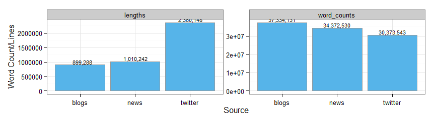
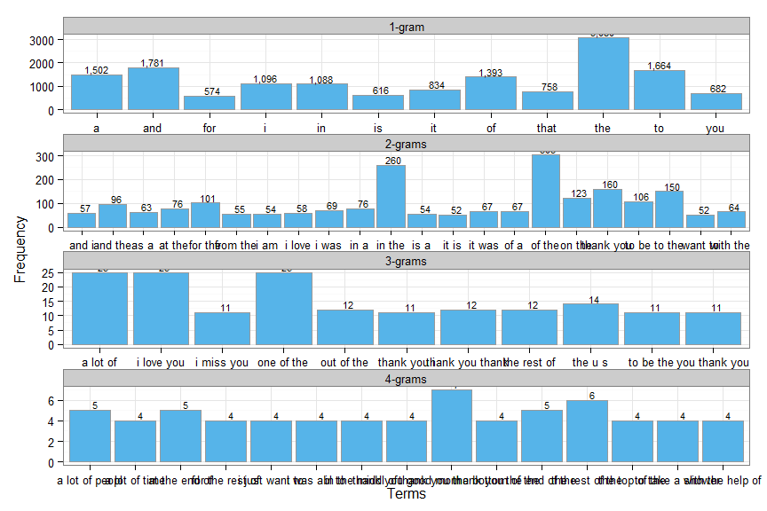
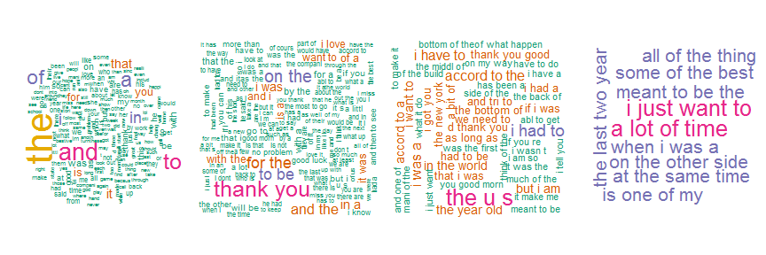
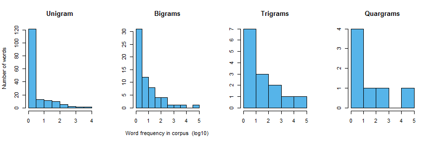

# SwiftKey NLP Milestone Report
Ben Apple  
27 March 2015  


### Introduction
This report is a breif description of the data provided for the Coursera Capstone SwiftKey NLP project.

The goal of this project is to make use of NLP techniques to build an R environment. The environment will be trained by a sample of a larger data set thathas been developed from the raw text files  provided by Coursera. The finlae goal is to produce an application that recomends the next word in a user entered string of words. 

In this report, the steps taken to preparse the text such as preprocess of raw text, preliminary statistics/visualization analysis, plans for algorithm and applications are introduced in order to provide readers with an idea of the scope of the project.

##### Main steps of the Capstone project. 


### Preprocess
TThe preprocess for text mining mainly includes cleaning, tokenization and stemming. These steps are intended to clean the raw text documents provided and transfer the documents into a form which can easily be used for further analysis . To be more specific, the following issues in text documents will be resolved during preprocess:

- Capital/Lower case
- Numbers
- Punctuations
- Whitespace
- Profanity words
- Special notation/Noise like mistypes, UTF-16 encoded characters, foreign words, etc.

A tokenization process has been constructed to resolve the above issues. The following is an output of applying this function to the corpus.
 
```
## 
## Please wait for initializing and summrising the input files......
## Documents below will be processed soon!
##                          Length Class             Mode
## en_US_blogs_sample.txt   2      PlainTextDocument list
## en_US_news_sample.txt    2      PlainTextDocument list
## en_US_twitter_sample.txt 2      PlainTextDocument list
## 
## Start tokenization processes...
## 
## 1.Simple Transformation: FALSE
## 2.Specific Transformations/Profanity filtering: TRUE
##  346 words will be filtered, following is a sample of the words:
##       swearwords target
## 1           2g1c    ***
## 2  2 girls 1 cup    ***
## 3 acrotomophilia    ***
## 4           anal    ***
## 5      anilingus    ***
## 
##  ->Specific Transformations/Profanity filtering have been done to raw document!
## 3.Lowercase Transformation: TRUE
##  ->All CAPITAL characters have been transformed to lower cases!
## 4.Remove Numbers: TRUE
##  ->All NUMBERs have been eliminated from raw document!
## 5.Remove Punctuations: TRUE
##  ->All Punctuations have been eliminated from raw document!
## 6.Remove Stop Words: FALSE
## 7.Remove Own Stop Words: FALSE
## 8.Strip Whitespace: TRUE
##  ->Whitespaces have been stripped from raw document!
## 
## Document has been tokenized!2 2 2 PlainTextDocument PlainTextDocument PlainTextDocument list list list
```

Stemming is applied to the corpus post tokenization to remove common word endings for English words, such as "es", "ed" and "s". 


At this stage we have compltetd the basic cleaning/transformation steps for the raw text that make up our corpus. We will do some preliminary statistics analysis and data visualisation to corpus.

### Basic Statistics/Visualization
In this part, we will do some basic statistics analysis and data visualization on our corpus. 
In the sections above, we explored the total lines and number of words in each document. Now we convert our text corpus into a matrix based on different ngrams and figure out the frequency and correlation between different words.

##### Total Word Count / Lines by Text Source. 


```
##     names    variable    value
## 1   blogs     lengths   899288
## 2    news     lengths  1010242
## 3 twitter     lengths  2360148
## 4   blogs word_counts 37334131
## 5    news word_counts 34372530
## 6 twitter word_counts 30373543
```

 

Okay Now we are going to have some fun with Word Coluds. The use of wordcloud diagrams give us some insight into the frequency of 1,2,3,4 grams terms while the below bar charts also display top frequent terms of our corpus in more traditional view. 

##### Terms frequency - Wordcloud / DTM

 
 

 

### Further Terms Frequency Analysis
#### Word frequency distribution
 

```
##        Type 50% Coverage % of Total Row 90% Coverage % of Total Row
## 1   Unigram          124          1.527         2783          34.26
## 2    Bigram        12584         27.531        39084          85.51
## 3   Trigram        30158         47.657        56658          89.53
## 4 Quatrgram        32772         49.734        59271          89.95
```

We can see in the above plots and table how many words it would take to reach 50% and 90% coverage in our 1-4 grams models.<br>
For example, 124 words are needed to account for 50% of the entire Unigram corpora and 2783 words are needed to account for 90% of the entire Unigram corpora. These numbers are reflected in the one-word sample corpus.

This report is intended to show that we have retrieved, explored, cleaned, and prepared the text for the actual goal of the capstone. This goal is to develop an application with user-friendly interface. Then release that application on a Shiny server. Considering shear size of the corpus the application must take the size and speed of model into account. 

The main functions that will be included in finale Shiny app:

- Detecting the nearest 1 to 3 words of users' typing and taking them as the inputs of model. 
- Return the predictions of model to the user interface.


